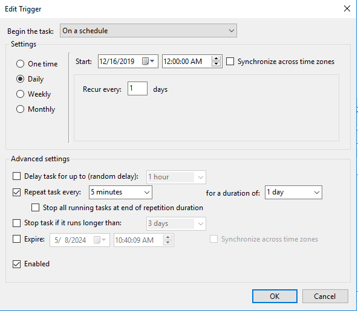
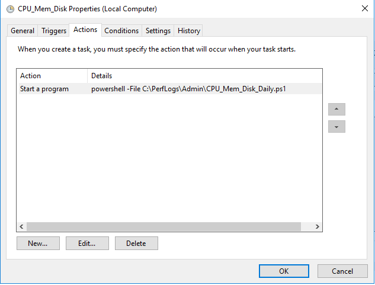
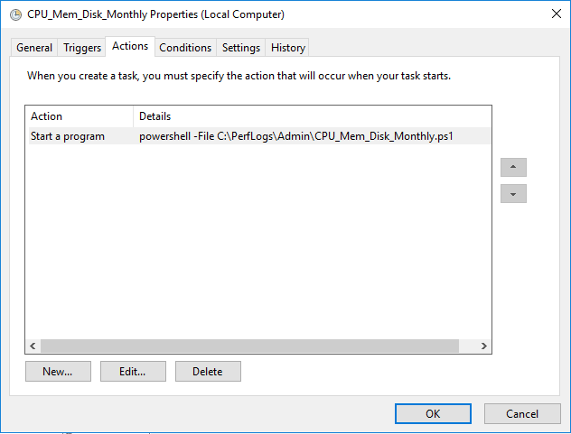

 

# CPU / Memory / Disk Performace Stat (Daily & Monthly)

Those scripts are for generate CPU usage, Memory usage and Disk usage csv.

Daily script is for generate full day performance usage csv, I will configure a schedule task to execute the daily script every 5 minutes.

Monthly script is for generate the monthly average performance usage csv, I will configure a schedule task to execute the monthly script on the 1st of month.

Daily script outputs: 
1) CPU usage
2) Mem usage
3) Disk usage

Monthly script will gather the daily outputs to calculate the avergae performance stats.

# Task Scheduler Screenshot

## CPU_Mem_Disk_Daily
 

## CPU_Mem_Disk_Monthly
 

